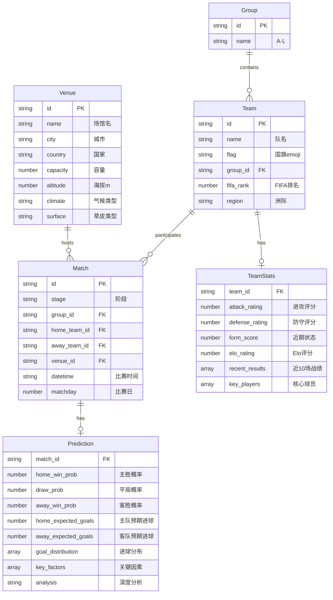

# 2026世界杯智能预测App - 技术架构文档

## 1. 架构设计

```mermaid
flowchart TB
    subgraph "前端层"
        "React 18 + TypeScript"
        "Tailwind CSS"
        "Zustand 状态管理"
        "Recharts 图表库"
    end
    subgraph "数据层"
        "Mock数据服务"
        "预测算法引擎"
        "天气/场地数据"
    end
    subgraph "外部服务"
        "FIFA排名数据"
        "历史对战数据"
    end
    "前端层" --> "数据层"
    "数据层" --> "外部服务"
```

## 2. 技术说明
- 前端框架：React@18 + TypeScript + Vite
- 样式方案：Tailwind CSS@3
- 状态管理：Zustand
- 图表库：Recharts（环形图、柱状图、折线图、条形图）
- 路由：React Router DOM v6
- 初始化工具：vite-init
- 后端：无（纯前端，数据内置）
- 数据库：无（使用本地JSON数据 + localStorage）

## 3. 路由定义
| 路由 | 用途 |
|------|------|
| / | 首页 - 赛事概览、今日焦点、倒计时 |
| /schedule | 赛程页 - 完整104场比赛赛程 |
| /match/:id | 预测详情页 - 单场比赛深度预测 |
| /teams | 球队页 - 48支队伍分组展示 |
| /team/:id | 球队详情页 - 单支队伍详细数据 |
| /dashboard | 数据看板 - 冠军预测、射手榜、统计 |

## 4. 数据模型

### 4.1 数据模型定义



### 4.2 预测算法说明

**综合预测模型**采用三层加权：

1. **Elo评分系统**（权重40%）
   - 基于FIFA排名和历史Elo评分
   - 考虑主客场因素（东道主加成）
   - 近期状态调整系数

2. **泊松回归模型**（权重35%）
   - 基于攻防评分计算预期进球数
   - 场地因素修正（海拔、气候适应性）
   - 天气因素修正（高温/降雨影响）

3. **蒙特卡洛模拟**（权重25%）
   - 10000次模拟比赛结果
   - 生成完整概率分布
   - 冠军/出线概率通过淘汰赛路径模拟

**场地因素修正**：
- 高海拔场馆（墨西哥城2240m、瓜达拉哈拉1566m）：对低海拔地区球队体能-5%
- 高温高湿（休斯敦、迈阿密）：对欧洲球队体能-3%
- 人工草皮（温哥华）：技术型球队-2%

**天气因素修正**：
- 基于6-7月历史天气数据
- 极端高温（>35°C）：进球数预期+0.3
- 降雨概率>60%：技术差距缩小10%

## 5. 项目结构

```
src/
├── components/          # 通用组件
│   ├── BottomNav.tsx    # 底部导航栏
│   ├── MatchCard.tsx    # 比赛卡片
│   ├── TeamBadge.tsx    # 球队徽章
│   ├── ProbabilityBar.tsx # 概率条
│   └── CountdownTimer.tsx # 倒计时
├── pages/               # 页面组件
│   ├── Home.tsx         # 首页
│   ├── Schedule.tsx     # 赛程页
│   ├── MatchDetail.tsx  # 预测详情页
│   ├── Teams.tsx        # 球队页
│   ├── TeamDetail.tsx   # 球队详情页
│   └── Dashboard.tsx    # 数据看板
├── data/                # 内置数据
│   ├── teams.ts         # 48支球队数据
│   ├── matches.ts       # 104场比赛数据
│   ├── venues.ts        # 16座场馆数据
│   └── predictions.ts   # 预测算法和数据
├── hooks/               # 自定义Hooks
│   ├── usePrediction.ts # 预测计算
│   └── useCountdown.ts  # 倒计时
├── store/               # Zustand状态
│   └── appStore.ts      # 全局状态
├── utils/               # 工具函数
│   ├── prediction.ts    # 预测算法核心
│   └── format.ts        # 格式化工具
├── App.tsx              # 根组件
└── main.tsx             # 入口文件
```
